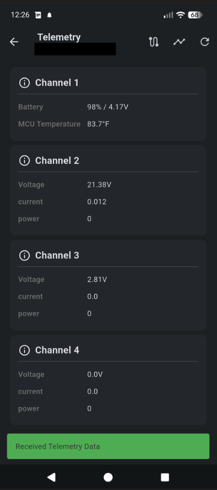

# MeshCore RAK WisBlock Repeater — Firmware Builder

Automated build and flash toolchain for [MeshCore](https://github.com/meshcore-dev/MeshCore)
`simple_repeater` firmware on a **RAK4631** (nRF52840) core fitted to a **RAK19007** base board,
with full three-channel telemetry from a **Voltaic MCSBC-SVR / Xpander** INA3221 power monitor.

Everything runs inside Docker — no local toolchain, PlatformIO, or nrfutil installation required.
Every invocation starts from a clean slate: stale firmware artifacts, the Docker image, and Python
caches are purged before each build.



---

## Hardware

| Component | Part |
|---|---|
| Core module | RAK4631 (nRF52840 + SX1262) |
| Base board | RAK19007 WisBlock Base |
| Power monitor | Voltaic MCSBC-SVR / Xpander (INA3221, address `0x42`) |
| I²C bus | Wire — pins 13 (SDA) / 14 (SCL) |

---

## Prerequisites

- **Docker** installed and running ([docs.docker.com/get-docker](https://docs.docker.com/get-docker/))
- Your user in the **`dialout`** group (for serial flash access):
  ```bash
  sudo usermod -aG dialout $USER   # log out and back in after
  ```
- Optional: install the bundled udev rule for persistent device permissions (see below).

---

## Quick start

```bash
git clone <this-repo>
cd meshcore_repeater_lto_build
chmod +x build_and_flash.sh
./build_and_flash.sh
```

The script will:

1. Purge any prior firmware artifacts, Docker image, and Python caches.
2. Build a fresh Docker image containing PlatformIO, adafruit-nrfutil, and pyserial.
3. Prompt you to select a **LoRa region**.
4. Show a build summary and ask for confirmation.
5. Clone MeshCore at the latest `main` commit (or a pinned commit), apply all patches, and compile.
6. Offer to flash the resulting DFU package to your connected device over USB.

---

## Options

| Flag | Description |
|---|---|
| `--commit <SHA>` / `-c` | Pin the build to a specific MeshCore git commit (default: latest `main`) |
| `--env <NAME>` / `-e` | PlatformIO environment name (default: `RAK_4631_repeater`) |
| `--help` / `-h` | Print usage |

---

## LoRa regions

| # | Region | Frequency |
|---|---|---|
| 1 | USA / Canada | 910.525 MHz |
| 2 | USA / Canada (alt 1) | 907.875 MHz |
| 3 | USA / Canada (alt 2) | 927.875 MHz |
| 4 | Europe / UK | 869.525 MHz |
| 5 | Europe (alt) | 868.731 MHz |
| 6 | Australia / New Zealand | 915.8 MHz |
| 7 | New Zealand (alt) | 917.375 MHz |

All regions use BW=250 kHz, SF=11.

---

## Flash methods

The script uses **adafruit-nrfutil DFU serial** flashing by default (runs entirely inside Docker).
If the device does not enumerate or you prefer drag-and-drop:

1. Double-tap RESET — the onboard LED will pulse slowly.
2. The RAK4631 mounts as a USB drive.
3. Copy the UF2 file:
   ```bash
   cp firmware.uf2 /path/to/mounted/drive/
   ```

---

## INA3221 patches

Three source-level patches are applied to every build to work around an nRF52 driver limitation:

| Step | What it does |
|---|---|
| 1 | Calls `INA3221.enableChannel(0/1/2)` immediately after `begin()` — the chip can power up with channels 1 and 2 disabled. |
| 2 | Removes the `isChannelEnabled(i)` guard in the telemetry loop. On nRF52 this call silently NAKs and returns `false` for channels 1 and 2, so only channel 0 ever appears in telemetry without this fix. |
| 3 | Injects `MESH_DEBUG_PRINTLN` per channel (compiles out completely in production — only active if `-D MESH_DEBUG=1` is added manually). |

INA3221 build flags injected into `variants/rak4631/platformio.ini`:

```
-D TELEM_INA3221_ADDRESS=0x42       # Voltaic MCSBC-SVR confirmed address
-D TELEM_INA3221_NUM_CHANNELS=3     # solar, battery, load
-D TELEM_INA3221_SHUNT_VALUE=0.100  # 0.1 Ω shunts
```

---

## Build artifacts

After a successful build three files are written to the project root:

| File | Use |
|---|---|
| `firmware.zip` | DFU package — used by the script for serial flashing |
| `firmware.hex` | Intel HEX — compatible with nrfjprog / J-Link |
| `firmware.uf2` | UF2 — drag-and-drop via the RAK4631 bootloader drive |

---

## udev rule (optional)

Install `99-rak4631.rules` once to give your user persistent read/write access to the serial
device without needing `sudo`:

```bash
sudo cp 99-rak4631.rules /etc/udev/rules.d/
sudo udevadm control --reload-rules
sudo udevadm trigger
```

---

## Project layout

```
.
├── build_and_flash.sh          Main entry point
├── 99-rak4631.rules            Optional udev rule
├── patches/
│   ├── ensure_ina3221_flag.py  Guarantees ENV_INCLUDE_INA3221=1 is set
│   ├── inject_ina3221_config.py  Injects INA3221 address / channel / shunt flags
│   ├── patch_env_sensor_manager.py  3-step nRF52 INA3221 driver fix
│   └── patch_lora_region.py    Sets LORA_FREQ / LORA_BW / LORA_SF
└── scripts/
    ├── container_build.sh      Runs inside build container (clone → patch → compile)
    ├── container_flash.sh      Runs inside flash container (DFU touch → nrfutil flash)
    └── dfu_touch.py            1200 bps DFU touch via pyserial
```
